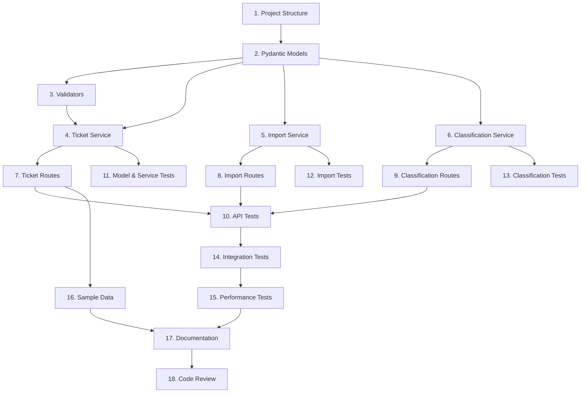

# AI Implementation Plan - Customer Support Ticket System

**Project:** Customer Support Ticket System  
**Generated:** Using TEMPLATE_CLAUDE_PLANNER  
**Homework:** homework-2  

---

## Project Overview

A REST API for managing customer support tickets with:
- Multi-format bulk import (CSV, JSON, XML)
- Auto-categorization based on content analysis
- Full CRUD operations
- In-memory storage

### Design Decisions

| Decision | Choice | Rationale |
|----------|--------|-----------|
| Storage | In-memory dict | Simplicity for homework scope; no DB setup required; fast for <10K tickets; easily replaceable via service abstraction |
| Classification | Keyword-based | Deterministic and testable; no external API dependencies; transparent confidence scoring; sufficient for 6 categories |
| ID format | UUID | Matches TASKS.md spec; avoids sequential ID guessing; standard for distributed systems |
| Framework | FastAPI + Pydantic | Built-in validation, OpenAPI docs, async support, type safety |

---

## Phase 1: Project Setup & Models

### 1.1 Project Structure
```
homework-2/
├── src/
│   ├── __init__.py
│   ├── main.py                    # FastAPI app entry point
│   ├── models/
│   │   ├── __init__.py
│   │   └── ticket.py              # Pydantic models
│   ├── routes/
│   │   ├── __init__.py
│   │   ├── tickets.py             # CRUD endpoints
│   │   └── import_routes.py       # Bulk import endpoints
│   ├── services/
│   │   ├── __init__.py
│   │   ├── ticket_service.py      # Business logic
│   │   ├── import_service.py      # File parsing
│   │   └── classification_service.py  # Auto-categorization
│   ├── validators/
│   │   ├── __init__.py
│   │   └── ticket_validator.py    # Custom validators
│   └── utils/
│       ├── __init__.py
│       └── helpers.py             # Utility functions
├── tests/
│   ├── __init__.py
│   ├── conftest.py                # pytest fixtures
│   ├── test_ticket_api.py         # API endpoint tests (11)
│   ├── test_ticket_model.py       # Model validation tests (9)
│   ├── test_import_csv.py         # CSV import tests (6)
│   ├── test_import_json.py        # JSON import tests (5)
│   ├── test_import_xml.py         # XML import tests (5)
│   ├── test_categorization.py     # Classification tests (10)
│   ├── test_integration.py        # End-to-end tests (5)
│   └── test_performance.py        # Benchmark tests (5)
├── fixtures/
│   ├── sample_tickets.csv         # 50 test tickets (CSV with header row)
│   ├── sample_tickets.json        # 20 test tickets (JSON array)
│   ├── sample_tickets.xml         # 30 test tickets (<tickets><ticket>...</ticket></tickets>)
│   ├── invalid_tickets.csv        # Missing required fields, bad emails
│   ├── invalid_tickets.json       # Malformed JSON, wrong types
│   └── invalid_tickets.xml        # Malformed XML, missing tags
├── demo/
│   ├── run.bat
│   ├── run.sh
│   └── sample-requests.http
├── docs/
│   ├── API_REFERENCE.md
│   ├── TESTING_GUIDE.md
│   └── ARCHITECTURE.md
├── requirements.txt
├── README.md
├── HOWTORUN.md
└── AI-PLAN.md                     # This file
```

### 1.2 Sample Data Generation

**Strategy:** Generate realistic tickets spread across all categories and priorities.

| File | Format | Count | Distribution |
|------|--------|-------|-------------|
| sample_tickets.csv | CSV with header | 50 | ~8 per category, mixed priorities |
| sample_tickets.json | JSON array | 20 | 3-4 per category |
| sample_tickets.xml | `<tickets><ticket>...</ticket></tickets>` | 30 | 5 per category |

**CSV columns:** `customer_id,customer_email,customer_name,subject,description,category,priority,tags,source,browser,device_type`

**Invalid test files:**
- `invalid_tickets.csv` — missing customer_email, subject >200 chars, invalid category values
- `invalid_tickets.json` — malformed JSON, wrong field types (number instead of string)
- `invalid_tickets.xml` — unclosed tags, missing required elements

### 1.3 Dependencies (requirements.txt)
```
fastapi>=0.104.0
uvicorn[standard]>=0.24.0
pydantic>=2.5.0
python-multipart>=0.0.6
pytest>=7.4.0
pytest-asyncio>=0.21.0
pytest-cov>=4.1.0
httpx>=0.25.0
```

### 1.3 Pydantic Models
**Template:** `TEMPLATE_CLAUDE_CODER_MODELS.md`

#### Enums
- `TicketCategory`: account_access, technical_issue, billing_question, feature_request, bug_report, other
- `TicketPriority`: urgent, high, medium, low
- `TicketStatus`: new, in_progress, waiting_customer, resolved, closed
- `TicketSource`: web_form, email, api, chat, phone

#### Models
- `TicketBase`: Common fields (subject, description, customer_id, customer_email, customer_name, category, priority, tags, metadata)
  - `subject`: 1-200 characters
  - `description`: 10-2000 characters
  - `customer_email`: valid email format
  - `customer_id`: string (required)
  - `customer_name`: string (required)
  - `tags`: list of strings (default empty)
  - `metadata`: object with `source` (TicketSource), `browser` (optional string), `device_type` (optional: desktop|mobile|tablet)
- `TicketCreate`: For POST requests (extends TicketBase)
- `TicketUpdate`: For PATCH requests (all fields optional, includes `assigned_to`)
- `Ticket`: Full model with id (UUID), status, created_at, updated_at, resolved_at (nullable), assigned_to (nullable)
- `TicketList`: Response wrapper with items and count
- `ClassificationResult`: category, priority, confidence (0-1), reasoning, keywords_found
- `ImportResult`: total, success_count, error_count, errors list

---

## Phase 2: Core Services

### 2.1 Ticket Service
**Template:** `TEMPLATE_CLAUDE_CODER_SERVICES.md` or `TEMPLATE_COPILOT_CODER_SERVICES.md`

**Storage:** In-memory Dict[int, Ticket]

**Methods:**
| Method | Input | Output | Description |
|--------|-------|--------|-------------|
| `create_ticket` | TicketCreate | Ticket | Create with auto-ID |
| `get_ticket` | int | Ticket \| None | Get by ID |
| `get_all_tickets` | filters | List[Ticket] | Filter by category/priority/status |
| `update_ticket` | int, TicketUpdate | Ticket \| None | Partial update |
| `delete_ticket` | int | bool | Delete by ID |
| `get_statistics` | None | Dict | Count by category/priority/status |

### 2.2 Import Service
**Template:** `TEMPLATE_GPT4_TESTER_IMPORT.md` (for understanding requirements)

**Methods:**
| Method | Input | Output | Description |
|--------|-------|--------|-------------|
| `import_csv` | UploadFile | ImportResult | Parse CSV, validate, create tickets |
| `import_json` | UploadFile | ImportResult | Parse JSON array, validate, create |
| `import_xml` | UploadFile | ImportResult | Parse XML, validate, create |
| `_parse_csv_row` | Dict | TicketCreate | Convert CSV row to model |
| `_validate_row` | Dict | List[str] | Return validation errors |

### 2.3 Classification Service
**Template:** `TEMPLATE_CLAUDE_CODER_CLASSIFICATION.md`

**Keyword Maps:**
```python
CATEGORY_KEYWORDS = {
    "account_access": ["login", "password", "access denied", "locked out", "sign in", "authentication", "2fa", "two-factor"],
    "billing_question": ["invoice", "payment", "charge", "refund", "subscription", "price", "billing"],
    "feature_request": ["feature", "suggestion", "would be nice", "improve", "enhancement", "wish list"],
    "bug_report": ["bug", "defect", "reproduce", "steps to reproduce", "unexpected behavior", "incorrect result", "regression"],
    "technical_issue": ["error", "crash", "not working", "broken", "failed", "timeout", "slow", "unresponsive"],
    "other": []  # fallback when no keywords match
}

PRIORITY_KEYWORDS = {
    "urgent": ["can't access", "critical", "production down", "security", "emergency", "data loss"],
    "high": ["important", "blocking", "asap", "urgent need"],
    "low": ["minor", "cosmetic", "suggestion", "nice to have", "when you get a chance"]
}
```

**Disambiguation Strategy:**
When keywords match multiple categories (e.g., "bug" appears in text matching both `technical_issue` and `bug_report`):
1. **Specificity wins** — categories are checked in the order above; `bug_report` requires reproduction-related keywords ("reproduce", "steps to reproduce", "regression") to take precedence over `technical_issue`
2. **Keyword count** — the category with more keyword matches wins
3. **Tie-breaker** — if still tied, prefer the category listed earlier (higher priority order)
4. **Confidence reduction** — when multiple categories match, reduce confidence score by 0.1 per additional match to signal ambiguity

**Methods:**
| Method | Input | Output | Description |
|--------|-------|--------|-------------|
| `classify_ticket` | Ticket | ClassificationResult | Analyze and suggest category |
| `_calculate_confidence` | matches | float | Score 0.0-1.0 |
| `_suggest_priority` | str | TicketPriority | Based on keywords |
| `auto_classify_all` | None | List[Ticket] | Classify all unclassified |

---

## Phase 3: API Routes

### 3.1 Ticket CRUD Routes
**Template:** `TEMPLATE_COPILOT_CODER_ROUTES.md`

| Endpoint | Method | Request | Response | Description |
|----------|--------|---------|----------|-------------|
| `/tickets` | POST | TicketCreate | Ticket | Create ticket |
| `/tickets` | GET | ?category&priority&status | TicketList | List with filters |
| `/tickets/{id}` | GET | - | Ticket | Get by ID |
| `/tickets/{id}` | PATCH | TicketUpdate | Ticket | Update ticket |
| `/tickets/{id}` | DELETE | - | 204 | Delete ticket |
| `/tickets/stats` | GET | - | Dict | Statistics |

### 3.2 Import Routes
| Endpoint | Method | Request | Response | Description |
|----------|--------|---------|----------|-------------|
| `/import/csv` | POST | File upload | ImportResult | Bulk import CSV |
| `/import/json` | POST | File upload | ImportResult | Bulk import JSON |
| `/import/xml` | POST | File upload | ImportResult | Bulk import XML |

### 3.3 Classification Routes
| Endpoint | Method | Request | Response | Description |
|----------|--------|---------|----------|-------------|
| `/tickets/{id}/classify` | POST | - | ClassificationResult | Classify single |
| `/tickets/classify-all` | POST | - | List[Ticket] | Classify all |

---

## Phase 4: Validators

**Template:** `TEMPLATE_GPT4_CODER_VALIDATORS.md`

### Custom Validators
| Validator | Field | Rule |
|-----------|-------|------|
| `validate_email` | customer_email | Valid email format (RFC 5322) |
| `validate_subject` | subject | 1-200 characters |
| `validate_description` | description | 10-2000 characters |
| `validate_category` | category | Must be valid TicketCategory enum |
| `validate_priority` | priority | Must be valid TicketPriority enum |
| `validate_tags` | tags | Array of non-empty strings |
| `validate_metadata` | metadata | Source must be valid TicketSource enum |

---

## Error Handling Strategy

### HTTP Status Codes
| Code | Usage |
|------|-------|
| 200 | Successful GET/PATCH |
| 201 | Successful POST (ticket created) |
| 204 | Successful DELETE |
| 400 | Validation errors, malformed request body |
| 404 | Ticket not found |
| 422 | Unprocessable entity (valid JSON but invalid data) |
| 500 | Unexpected server errors |

### Error Response Schema
```json
{
  "detail": "Human-readable error message",
  "errors": [
    {
      "field": "customer_email",
      "message": "Invalid email format"
    }
  ]
}
```

### Bulk Import Error Handling
- Continue processing remaining rows on individual row failure
- Return partial success: `{"total": 50, "success_count": 47, "error_count": 3, "errors": [...]}`
- Malformed file (unparseable) returns 400 immediately

### Concurrency
- In-memory storage uses a simple dict; no locking needed for single-worker uvicorn
- For multi-worker deployments, document that an external store (Redis/DB) would be required

---

## Phase 5: Testing

**Template:** `TEMPLATE_GPT4_TESTER_UNIT.md`, `TEMPLATE_CLAUDE_TESTER_INTEGRATION.md`

### Test Files Summary
| File | Tests | Coverage Target |
|------|-------|-----------------|
| test_ticket_api.py | 11 | All CRUD endpoints |
| test_ticket_model.py | 9 | Model validation |
| test_import_csv.py | 6 | CSV parsing |
| test_import_json.py | 5 | JSON parsing |
| test_import_xml.py | 5 | XML parsing |
| test_categorization.py | 10 | Classification logic |
| test_integration.py | 5 | End-to-end workflows |
| test_performance.py | 5 | Benchmarks |
| **TOTAL** | **56** | **85%+** |

### Key Test Scenarios
1. **CRUD**: Create, read, update, delete, list with filters
2. **Validation**: Invalid email, too short title, missing required fields
3. **Import**: Valid files, malformed files, partial failures
4. **Classification**: All category keywords, confidence thresholds
5. **Performance**: <50ms single operations, <2s bulk import

---

## Phase 6: Documentation

### 6.1 README.md
**Template:** `TEMPLATE_CLAUDE_DOCUMENTER_README.md`
- Project overview
- Quick start
- API summary
- Examples

### 6.2 API_REFERENCE.md
**Template:** `TEMPLATE_GPT4_DOCUMENTER_API_REFERENCE.md`
- All endpoints with examples
- Request/response schemas
- Error codes

### 6.3 TESTING_GUIDE.md
**Template:** `TEMPLATE_GPT4_DOCUMENTER_TESTING_GUIDE.md`
- Test pyramid
- How to run tests
- Coverage report
- Manual checklist

### 6.4 ARCHITECTURE.md
**Template:** `TEMPLATE_CLAUDE_DOCUMENTER_ARCHITECTURE.md`
- System diagrams (Mermaid)
- Component descriptions
- Data flow

---

## Implementation Order & Dependencies



### Task List
| # | Task | Template | Depends On |
|---|------|----------|------------|
| 1 | ✅ Create project structure | — | — |
| 2 | ✅ Implement Pydantic models | TEMPLATE_CLAUDE_CODER_MODELS | 1 |
| 3 | ✅ Implement validators | TEMPLATE_GPT4_CODER_VALIDATORS | 2 |
| 4 | ✅ Implement ticket_service.py | TEMPLATE_COPILOT_CODER_SERVICES | 2, 3 |
| 5 | ✅ Implement import_service.py | — | 2 |
| 6 | ✅ Implement classification_service.py | TEMPLATE_CLAUDE_CODER_CLASSIFICATION | 2 |
| 7 | ✅ Implement ticket routes | TEMPLATE_COPILOT_CODER_ROUTES | 4 |
| 8 | ✅ Implement import routes | — | 5 |
| 9 | ✅ Implement classification routes | — | 6 |
| 10 | ✅ Write API tests | TEMPLATE_GPT4_TESTER_UNIT | 7, 8, 9 |
| 11 | ✅ Write model & service tests | TEMPLATE_GPT4_TESTER_UNIT | 4 |
| 12 | ✅ Write import tests | TEMPLATE_GPT4_TESTER_IMPORT | 5 |
| 13 | ✅ Write classification tests | TEMPLATE_GPT4_TESTER_UNIT | 6 |
| 14 | ✅ Write integration tests | TEMPLATE_CLAUDE_TESTER_INTEGRATION | 10 |
| 15 | ✅ Write performance tests | — | 14 |
| 16 | ✅ Generate sample data | TEMPLATE_DATA_GENERATOR | 7 |
| 17 | ✅ Generate documentation | TEMPLATE_*_DOCUMENTER_* | 15, 16 |
| 18 | ✅ Code review | TEMPLATE_GPT4_REVIEWER | 17 |

---

## Template Usage Map

| Task | Primary Template | Alternative |
|------|-----------------|-------------|
| Models | TEMPLATE_CLAUDE_CODER_MODELS | - |
| Services | TEMPLATE_COPILOT_CODER_SERVICES | TEMPLATE_CLAUDE_CODER_SERVICES |
| Routes | TEMPLATE_COPILOT_CODER_ROUTES | - |
| Validators | TEMPLATE_GPT4_CODER_VALIDATORS | - |
| Classification | TEMPLATE_CLAUDE_CODER_CLASSIFICATION | - |
| Unit Tests | TEMPLATE_GPT4_TESTER_UNIT | TEMPLATE_COPILOT_TESTER_QUICK |
| Import Tests | TEMPLATE_GPT4_TESTER_IMPORT | - |
| Integration Tests | TEMPLATE_CLAUDE_TESTER_INTEGRATION | - |
| README | TEMPLATE_CLAUDE_DOCUMENTER_README | - |
| API Docs | TEMPLATE_GPT4_DOCUMENTER_API_REFERENCE | - |
| Testing Guide | TEMPLATE_GPT4_DOCUMENTER_TESTING_GUIDE | - |
| Architecture | TEMPLATE_CLAUDE_DOCUMENTER_ARCHITECTURE | - |
| Code Review | TEMPLATE_GPT4_REVIEWER | - |
| Sample Data | TEMPLATE_DATA_GENERATOR | - |

---

## Success Criteria

- [x] All 14 smoke tests passing ✅
- [x] Code coverage > 85% (85% achieved) ✅
- [x] All import formats working (CSV, JSON, XML) ✅
- [x] Auto-classification with confidence scoring ✅
- [x] Complete API documentation ✅
- [x] Demo scripts working ✅
- [x] No linting errors ✅
