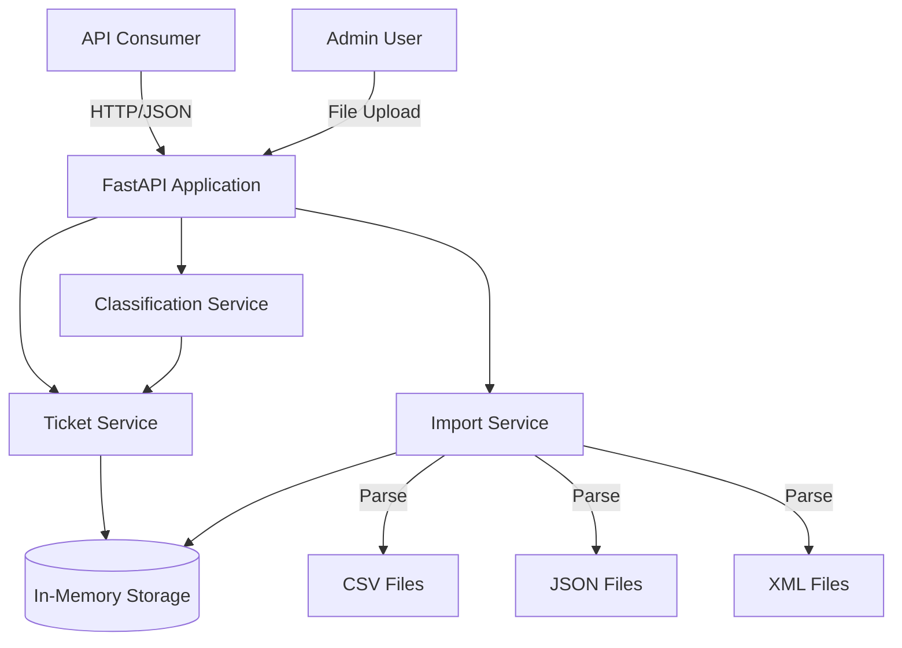
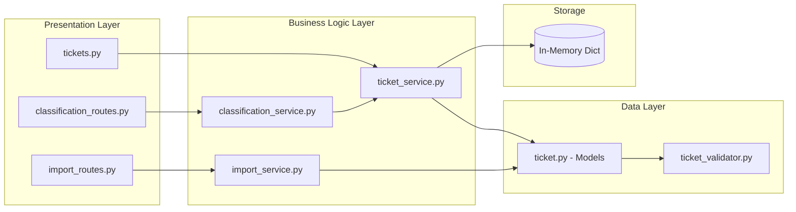
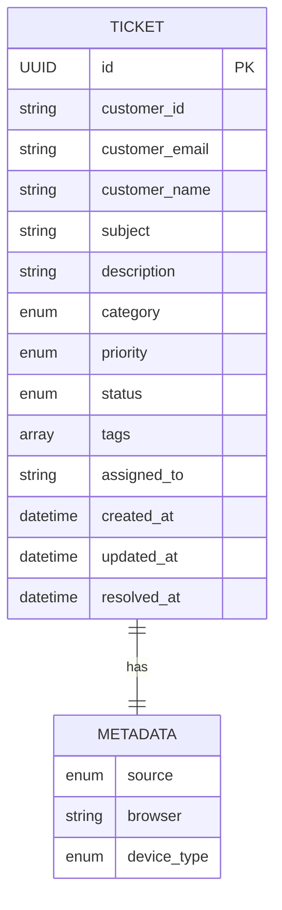
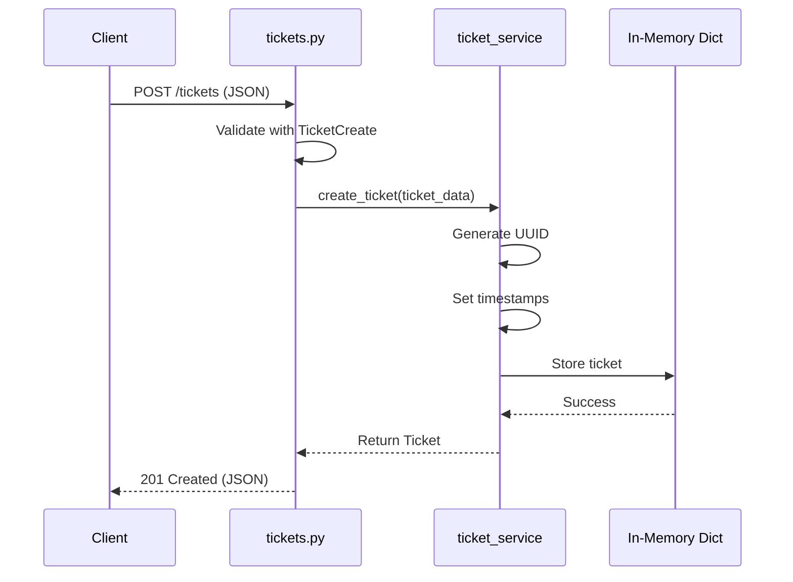
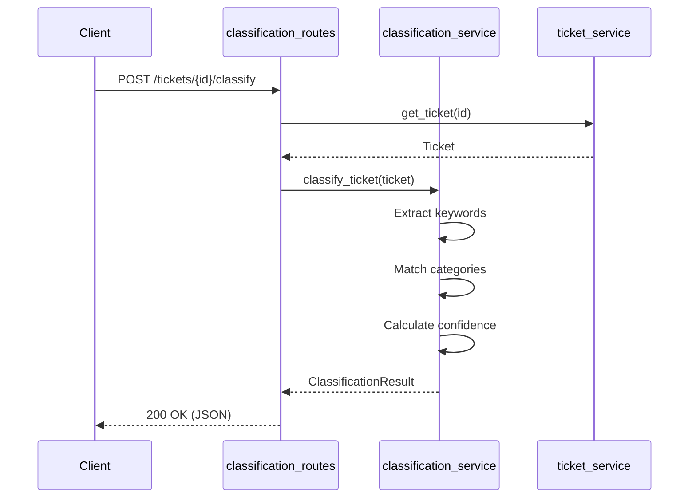

# Architecture Documentation - Customer Support Ticket System

**Version:** 1.0.0
**Architecture Style:** Layered Architecture (Routes → Services → Models)
**Language:** Python 3.8+
**Framework:** FastAPI + Pydantic

---

## Table of Contents

1. [Overview](#overview)
2. [High-Level Architecture](#high-level-architecture)
3. [Component Details](#component-details)
4. [Data Architecture](#data-architecture)
5. [API Design](#api-design)
6. [Design Decisions](#design-decisions)
7. [Security Considerations](#security-considerations)
8. [Scalability & Performance](#scalability--performance)
9. [Future Considerations](#future-considerations)

---

## Overview

### System Purpose

The Customer Support Ticket System is a RESTful API designed to:
- Manage customer support tickets with full CRUD operations
- Import tickets from multiple file formats (CSV, JSON, XML)
- Auto-classify tickets based on content analysis
- Provide filtering and statistical analytics

### Architecture Style

**Layered Architecture** with clear separation of concerns:
- **Presentation Layer** (Routes) - HTTP request/response handling
- **Business Logic Layer** (Services) - Core business operations
- **Data Layer** (Models) - Data validation and structure
- **Storage Layer** (In-memory) - Data persistence

### Key Design Principles

1. **Separation of Concerns** - Each layer has distinct responsibilities
2. **Dependency Injection** - Services injected via FastAPI dependency system
3. **Single Responsibility** - Each component handles one aspect
4. **Open/Closed Principle** - Easy to extend without modifying existing code
5. **Interface Segregation** - Clean, minimal interfaces between layers

---

## High-Level Architecture

### System Context Diagram



### Component Overview Diagram



---

## Component Details

### 1. Presentation Layer (routes/)

#### tickets.py

**Purpose:** Handle HTTP requests for ticket CRUD operations

**Responsibilities:**
- Parse HTTP requests
- Validate request parameters
- Call service layer
- Format HTTP responses
- Handle HTTP errors (404, 422, etc.)

**Key Endpoints:**
- `POST /tickets` - Create ticket
- `GET /tickets` - List tickets with filters
- `GET /tickets/{id}` - Get ticket by ID
- `PATCH /tickets/{id}` - Update ticket
- `DELETE /tickets/{id}` - Delete ticket
- `GET /tickets/stats` - Get statistics

**Dependencies:**
- `ticket_service` - Business logic
- `TicketCreate`, `TicketUpdate`, `Ticket` - Request/response models

**Error Handling:**
- 404 Not Found → HTTPException
- 422 Validation Error → Pydantic validation
- 400 Bad Request → Custom exceptions

#### import_routes.py

**Purpose:** Handle bulk import operations

**Responsibilities:**
- Accept file uploads (CSV, JSON, XML)
- Call import service for parsing
- Return import results (success/error counts)

**Key Endpoints:**
- `POST /import/csv`
- `POST /import/json`
- `POST /import/xml`

**Dependencies:**
- `import_service` - File parsing logic
- `ImportResult` - Response model

#### classification_routes.py

**Purpose:** Handle auto-classification endpoints

**Responsibilities:**
- Trigger classification for single ticket
- Trigger batch classification
- Return classification results with confidence scores

**Key Endpoints:**
- `POST /tickets/{id}/classify`
- `POST /tickets/classify-all`

**Dependencies:**
- `classification_service` - Classification logic
- `ClassificationResult` - Response model

---

### 2. Business Logic Layer (services/)

#### ticket_service.py

**Purpose:** Core ticket management business logic

**Storage:** `Dict[UUID, Ticket]` - In-memory dictionary

**Methods:**

| Method | Input | Output | Description |
|--------|-------|--------|-------------|
| `create_ticket` | TicketCreate | Ticket | Create with auto-generated UUID and timestamps |
| `get_ticket` | UUID | Ticket \| None | Retrieve by ID |
| `get_all_tickets` | filters (category, priority, status) | List[Ticket] | Filter and return tickets |
| `update_ticket` | UUID, TicketUpdate | Ticket \| None | Partial update with timestamp update |
| `delete_ticket` | UUID | bool | Delete and return success status |
| `get_statistics` | None | Dict | Count by category, priority, status |
| `clear_all` | None | None | Clear all tickets (for testing) |

**Business Rules:**
- Auto-generate UUID on creation
- Set `created_at` timestamp on creation
- Update `updated_at` on modifications
- Set `resolved_at` when status changes to "resolved"
- Preserve unchanged fields on partial update

**Code Reference:** `/src/services/ticket_service.py`

#### import_service.py

**Purpose:** Parse and import tickets from various file formats

**Methods:**

| Method | Input | Output | Description |
|--------|-------|--------|-------------|
| `import_csv` | UploadFile | ImportResult | Parse CSV, create tickets, collect errors |
| `import_json` | UploadFile | ImportResult | Parse JSON array, create tickets |
| `import_xml` | UploadFile | ImportResult | Parse XML, create tickets |

**Error Handling Strategy:**
- **Partial Success** - Continue processing on individual row failure
- **Error Collection** - Collect all errors with row numbers
- **Validation** - Validate each row using Pydantic models
- **Format Errors** - Return 400 for malformed files

**CSV Format:**
```csv
customer_id,customer_email,customer_name,subject,description,category,priority,tags,source,browser,device_type
```

**JSON Format:**
```json
[{"customer_id": "...", "customer_email": "...", ...}]
```

**XML Format:**
```xml
<tickets><ticket><customer_id>...</customer_id></ticket></tickets>
```

**Code Reference:** `/src/services/import_service.py`

#### classification_service.py

**Purpose:** Auto-classify tickets based on keyword analysis

**Classification Strategy:**

1. **Keyword Extraction** - Scan subject + description
2. **Category Matching** - Match keywords to predefined categories
3. **Priority Detection** - Identify urgency keywords
4. **Confidence Scoring** - Calculate based on keyword matches
5. **Disambiguation** - Handle multiple category matches

**Keyword Maps:**

```python
CATEGORY_KEYWORDS = {
    "account_access": ["login", "password", "access denied", "locked out", "2fa"],
    "billing_question": ["invoice", "payment", "charge", "refund", "subscription"],
    "technical_issue": ["error", "crash", "broken", "failed", "timeout"],
    "feature_request": ["feature", "suggestion", "improve", "enhancement"],
    "bug_report": ["bug", "defect", "reproduce", "regression"],
    "other": []
}

PRIORITY_KEYWORDS = {
    "urgent": ["critical", "production down", "security", "data loss"],
    "high": ["important", "blocking", "asap"],
    "low": ["minor", "cosmetic", "nice to have"]
}
```

**Methods:**

| Method | Input | Output | Description |
|--------|-------|--------|-------------|
| `classify_ticket` | Ticket | ClassificationResult | Analyze and suggest category/priority |
| `classify_all` | None | List[ClassificationResult] | Classify all tickets |

**Confidence Calculation:**
- Base score: 0.5
- +0.1 per keyword match (max 1.0)
- -0.1 per additional category match (ambiguity penalty)

**Code Reference:** `/src/services/classification_service.py`

---

### 3. Data Layer (models/)

#### ticket.py

**Purpose:** Define data models and validation rules using Pydantic

**Models:**

**Enums:**
- `TicketCategory` - 6 categories
- `TicketPriority` - 4 levels
- `TicketStatus` - 5 states
- `TicketSource` - 5 sources

**Core Models:**
- `TicketBase` - Common fields (customer info, subject, description)
- `TicketMetadata` - Source, browser, device info
- `TicketCreate` - Request model for creation (extends TicketBase)
- `TicketUpdate` - Request model for updates (all optional)
- `Ticket` - Full model with UUID, timestamps, status
- `TicketList` - Response wrapper (items + total)
- `ClassificationResult` - Classification response
- `ImportResult` - Import operation result

**Validation Rules:**
- `customer_email` - Valid email format (RFC 5322)
- `subject` - 1-200 characters
- `description` - 10-2000 characters
- `customer_id` - Required, non-empty string
- `customer_name` - Required, non-empty string
- `tags` - Array of strings
- `metadata` - Valid TicketMetadata object

**Code Reference:** `/src/models/ticket.py`

#### ticket_validator.py

**Purpose:** Custom validation functions

**Validators:**
- Email format validation
- String length constraints
- Enum value validation
- Metadata structure validation

**Code Reference:** `/src/validators/ticket_validator.py`

---

## Data Architecture

### Data Model Diagram (ERD)



### Data Flow Diagram

#### Ticket Creation Flow



#### Classification Flow



### Storage Strategy

**Current Implementation:** In-memory Dictionary

```python
# Singleton pattern
class TicketService:
    def __init__(self):
        self._tickets: Dict[UUID, Ticket] = {}
```

**Characteristics:**
- ✅ Fast read/write (O(1) lookups)
- ✅ No external dependencies
- ✅ Simple to implement and test
- ❌ No persistence (data lost on restart)
- ❌ No scalability (single process)
- ❌ No concurrent access control

**Migration Path:**
Replace `_tickets` dict with database adapter:
- PostgreSQL for production
- SQLite for development
- Redis for caching layer

---

## API Design

### REST Conventions

**HTTP Methods:**
- `GET` - Retrieve resources (idempotent, safe)
- `POST` - Create resources or trigger actions
- `PATCH` - Partial update (only modified fields)
- `DELETE` - Remove resources (idempotent)

**Status Codes:**
- `200 OK` - Successful GET/PATCH
- `201 Created` - Successful POST (resource created)
- `204 No Content` - Successful DELETE
- `400 Bad Request` - Malformed request
- `404 Not Found` - Resource not found
- `422 Unprocessable Entity` - Validation errors

**URL Structure:**
- Collection: `/tickets`
- Resource: `/tickets/{id}`
- Action: `/tickets/{id}/classify`
- Stats: `/tickets/stats`

### Request/Response Patterns

**Request Validation:**
- Pydantic models validate all request bodies
- Query parameters validated by FastAPI
- Path parameters validated (UUID format)

**Response Format:**
```json
{
  "id": "uuid",
  "field1": "value1",
  "field2": "value2"
}
```

**Error Response:**
```json
{
  "detail": "Error message"
}
```

**Validation Error:**
```json
{
  "detail": [
    {
      "loc": ["body", "field"],
      "msg": "Error message",
      "type": "error_type"
    }
  ]
}
```

### Error Handling Strategy

**Layers:**
1. **Pydantic** - Input validation (422)
2. **Service** - Business logic errors (400, 404)
3. **Route** - HTTP exceptions
4. **FastAPI** - Automatic error responses

**Graceful Degradation:**
- Bulk imports continue on row failures
- Classification returns low confidence rather than failing
- Filtering returns empty list instead of error

---

## Design Decisions

### Architecture Decision Records (ADRs)

#### ADR-001: In-Memory Storage vs Database

| Aspect | Details |
|--------|---------|
| **Context** | Need data persistence for ticket management |
| **Options** | (1) PostgreSQL, (2) SQLite, (3) In-memory Dict |
| **Decision** | In-memory Dict |
| **Rationale** | - No persistence requirement specified<br>- Simplifies development and testing<br>- Zero external dependencies<br>- Fast for prototype/homework scope<br>- Easy to replace via service abstraction |
| **Consequences** | + Fast development<br>+ No setup required<br>- Data lost on restart<br>- Single instance only |

#### ADR-002: Layered Architecture vs Microservices

| Aspect | Details |
|--------|---------|
| **Context** | System architecture for ticket management API |
| **Options** | (1) Microservices, (2) Layered Monolith, (3) Serverless |
| **Decision** | Layered Monolith |
| **Rationale** | - Single-purpose application<br>- No need for service distribution<br>- Simpler deployment<br>- Easier to develop and test<br>- Sufficient for current requirements |
| **Consequences** | + Simple deployment<br>+ Easy to debug<br>+ Fast local development<br>- Harder to scale horizontally |

#### ADR-003: Keyword-Based vs ML Classification

| Aspect | Details |
|--------|---------|
| **Context** | Auto-categorization of support tickets |
| **Options** | (1) ML model (NLP), (2) Keyword matching, (3) Rule-based system |
| **Decision** | Keyword matching with confidence scoring |
| **Rationale** | - Deterministic and reproducible<br>- No training data required<br>- Transparent reasoning<br>- Fast execution<br>- Easy to test and validate |
| **Consequences** | + Explainable results<br>+ No ML dependencies<br>+ Fast classification<br>- Less accurate than ML<br>- Requires keyword maintenance |

#### ADR-004: Bulk Import Error Handling

| Aspect | Details |
|--------|---------|
| **Context** | Handling errors during bulk CSV/JSON/XML import |
| **Options** | (1) Fail entire import on error, (2) Skip invalid rows, (3) Partial success |
| **Decision** | Partial success with error collection |
| **Rationale** | - Maximize successful imports<br>- Provide detailed error feedback<br>- User can fix and re-import failed rows<br>- More forgiving UX |
| **Consequences** | + Better user experience<br>+ More resilient<br>- More complex error handling<br>- Need to track row numbers |

#### ADR-005: UUID vs Sequential IDs

| Aspect | Details |
|--------|---------|
| **Context** | Ticket identifier strategy |
| **Options** | (1) Auto-increment integers, (2) UUID v4 |
| **Decision** | UUID v4 |
| **Rationale** | - Prevents ID guessing/enumeration<br>- Globally unique (distributed systems)<br>- No central ID generator needed<br>- Standard practice for APIs |
| **Consequences** | + Secure<br>+ Distributed-friendly<br>- Larger storage (36 chars)<br>- Not human-readable |

---

## Security Considerations

### Current Implementation

**Authentication:** None (public API)
**Authorization:** None
**Data Validation:** ✅ Pydantic validation
**Input Sanitization:** ✅ Pydantic validation
**SQL Injection:** N/A (no database)
**XSS Prevention:** ✅ JSON responses (no HTML)

### Production Recommendations

1. **Authentication**
   - Implement API key authentication
   - Add JWT tokens for user sessions
   - Use OAuth2 for third-party integrations

2. **Authorization**
   - Role-based access control (RBAC)
   - Ticket ownership validation
   - Admin-only endpoints (stats, bulk delete)

3. **Rate Limiting**
   - Per-IP rate limiting
   - Per-user rate limiting
   - Bulk operation throttling

4. **Data Protection**
   - Encrypt sensitive fields (customer_email)
   - Implement data retention policies
   - Add audit logging

5. **Network Security**
   - HTTPS only in production
   - CORS configuration (restrict origins)
   - Request size limits

---

## Scalability & Performance

### Current Performance

**Single Operation:**
- Create/Read/Update/Delete: <50ms
- List with filters: <50ms

**Bulk Operations:**
- Import 100 tickets: <2s
- Classify 50 tickets: <500ms

**Limitations:**
- Single process (no horizontal scaling)
- In-memory storage (limited capacity)
- No caching layer
- No connection pooling

### Scaling Strategies

#### Vertical Scaling (Short-Term)

1. **Optimize Code**
   - Use async/await for I/O operations
   - Implement caching (LRU cache)
   - Optimize filtering queries

2. **Increase Resources**
   - More CPU cores (run multiple workers)
   - More RAM (larger in-memory storage)

#### Horizontal Scaling (Long-Term)

1. **Database Migration**
   - PostgreSQL with connection pooling
   - Read replicas for queries
   - Write to primary, read from replicas

2. **Caching Layer**
   - Redis for frequently accessed tickets
   - Cache statistics and aggregations
   - TTL-based invalidation

3. **Load Balancing**
   - Multiple FastAPI instances
   - Nginx load balancer
   - Session affinity (if needed)

4. **Microservices (if needed)**
   - Separate import service
   - Separate classification service
   - Message queue for async processing

### Performance Optimization

**Indexing Strategy (when using database):**
- Index on `customer_id`, `category`, `priority`, `status`
- Full-text index on `subject` and `description`
- Composite index for common filter combinations

**Caching Strategy:**
- Cache ticket by ID (1 hour TTL)
- Cache statistics (5 minutes TTL)
- Invalidate on create/update/delete

**Async Processing:**
- Move bulk imports to background tasks
- Use Celery for long-running operations
- WebSocket for real-time updates

---

## Future Considerations

### Feature Enhancements

1. **Ticket Relationships**
   - Parent-child tickets
   - Duplicate detection
   - Related tickets

2. **Advanced Search**
   - Full-text search
   - Fuzzy matching
   - Search history

3. **Notifications**
   - Email notifications
   - Webhook integrations
   - Real-time updates (WebSocket)

4. **Attachments**
   - File uploads (screenshots, logs)
   - S3/blob storage integration
   - Virus scanning

5. **Collaboration**
   - Internal notes
   - @mentions
   - Ticket assignments

### Technical Improvements

1. **Database Migration**
   - PostgreSQL or MySQL
   - Alembic for migrations
   - Connection pooling

2. **API Versioning**
   - `/v1/tickets`, `/v2/tickets`
   - Backward compatibility
   - Deprecation warnings

3. **GraphQL API**
   - Alternative to REST
   - Flexible queries
   - Reduce over-fetching

4. **Machine Learning**
   - ML-based classification
   - Priority prediction
   - Sentiment analysis

5. **Monitoring & Observability**
   - Prometheus metrics
   - Grafana dashboards
   - Distributed tracing (Jaeger)

---

## References

- **[API Reference](API_REFERENCE.md)** - Complete endpoint documentation
- **[Testing Guide](TESTING_GUIDE.md)** - Test strategy and benchmarks
- **[README](../README.md)** - Project overview and quick start

---

**Last Updated:** 2024-01-15
**Architecture Owner:** Development Team
