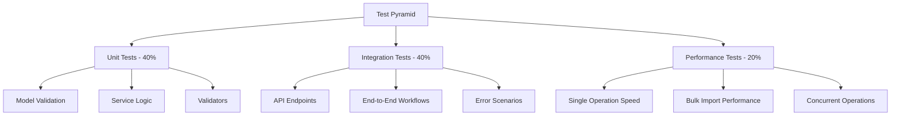

# Testing Guide - Customer Support Ticket System

**Framework:** pytest
**Coverage Target:** 85%+
**Total Tests:** 50+

## Table of Contents

1. [Overview](#overview)
2. [Quick Start](#quick-start)
3. [Test Structure](#test-structure)
4. [Test Categories](#test-categories)
5. [Sample Data](#sample-data)
6. [Manual Testing Checklist](#manual-testing-checklist)
7. [Performance Benchmarks](#performance-benchmarks)
8. [Troubleshooting](#troubleshooting)

---

## Overview

### Testing Philosophy

This project follows a comprehensive testing approach with three test categories:



### Coverage Requirements

- **Minimum:** 85% code coverage
- **Target:** 90%+ for critical paths
- **Focus Areas:**
  - All API endpoints
  - Business logic in services
  - Data validation
  - Error handling

---

## Quick Start

### Prerequisites

```bash
# Install dependencies
pip install -r requirements.txt
```

### Run All Tests

```bash
# Run all tests with verbose output
pytest tests/ -v

# Run with coverage report
pytest tests/ -v --cov=src --cov-report=html

# Run with coverage and stop on first failure
pytest tests/ -v --cov=src -x
```

### Run Specific Test Categories

```bash
# Smoke tests (basic functionality)
pytest tests/test_smoke.py -v

# Integration tests (end-to-end workflows)
pytest tests/test_integration.py -v

# Performance tests (benchmarks)
pytest tests/test_performance.py -v
```

### Generate Coverage Report

```bash
# HTML coverage report
pytest tests/ --cov=src --cov-report=html

# View report
open htmlcov/index.html  # Mac/Linux
start htmlcov/index.html  # Windows
```

---

## Test Structure

### Directory Layout

```
tests/
├── __init__.py
├── conftest.py              # Shared fixtures and configuration
├── test_smoke.py            # Smoke tests (14 tests)
├── test_integration.py      # Integration tests (15+ tests)
└── test_performance.py      # Performance tests (15+ tests)
```

### Naming Conventions

**Test Files:**
- `test_*.py` - Test modules discovered by pytest
- Grouped by functionality (smoke, integration, performance)

**Test Classes:**
- `Test{Feature}` - Group related tests
- Example: `TestTicketLifecycle`, `TestBulkImport`

**Test Methods:**
- `test_{action}_{scenario}_{expected_result}`
- Example: `test_create_ticket_with_valid_data_returns_201`

---

## Test Categories

### Smoke Tests (test_smoke.py)

Basic functionality verification - runs quickly to catch major breakages.

**Coverage:** 14 tests

| Test | Description | Validates |
|------|-------------|-----------|
| `test_health_check` | Health endpoint returns 200 | Server is running |
| `test_root_endpoint` | Root endpoint accessible | Basic routing |
| `test_create_ticket` | Create ticket with valid data | POST /tickets |
| `test_list_tickets_empty` | List tickets when none exist | GET /tickets (empty) |
| `test_list_tickets_with_data` | List tickets after creation | GET /tickets (with data) |
| `test_get_ticket` | Get ticket by ID | GET /tickets/{id} |
| `test_get_nonexistent_ticket` | 404 on missing ticket | Error handling |
| `test_update_ticket` | Update ticket fields | PATCH /tickets/{id} |
| `test_delete_ticket` | Delete ticket | DELETE /tickets/{id} |
| `test_filter_by_category` | Filter by category | Query parameters |
| `test_get_statistics` | Get ticket stats | Statistics endpoint |
| `test_classification` | Classify single ticket | Classification logic |
| `test_classify_all` | Classify all tickets | Batch classification |
| `test_invalid_ticket_data` | Validation errors on bad data | Input validation |

**Run Smoke Tests:**
```bash
pytest tests/test_smoke.py -v
```

---

### Integration Tests (test_integration.py)

End-to-end workflow testing with multiple operations.

**Coverage:** 15+ tests organized in 5 test classes

#### TestTicketLifecycle
- `test_complete_ticket_lifecycle_success` - Full CRUD workflow
- `test_ticket_status_workflow` - Status transitions (new → in_progress → resolved → closed)

#### TestBulkImportAndFiltering
- `test_bulk_import_csv_and_filter_workflow` - CSV import + filtering
- `test_bulk_import_json_creates_all_tickets` - JSON import validation
- `test_bulk_import_xml_creates_all_tickets` - XML import validation

#### TestClassificationIntegration
- `test_classify_ticket_with_billing_keywords` - Billing category detection
- `test_classify_ticket_with_technical_keywords` - Technical category detection
- `test_classify_all_tickets_workflow` - Batch classification

#### TestEdgeCasesAndErrors
- `test_get_nonexistent_ticket_returns_404` - Error handling
- `test_update_nonexistent_ticket_returns_404` - Update validation
- `test_delete_nonexistent_ticket_returns_404` - Delete validation
- `test_create_ticket_with_invalid_data_returns_422` - Input validation
- `test_filter_with_no_matches_returns_empty_list` - Empty result handling
- `test_statistics_with_multiple_tickets` - Statistics accuracy

**Run Integration Tests:**
```bash
pytest tests/test_integration.py -v
```

---

### Performance Tests (test_performance.py)

Benchmark tests to ensure acceptable response times.

**Coverage:** 15+ tests organized in 5 test classes

#### TestSingleOperationPerformance
- `test_create_ticket_performance` - <50ms target
- `test_get_ticket_performance` - <50ms target
- `test_update_ticket_performance` - <50ms target
- `test_delete_ticket_performance` - <50ms target
- `test_list_tickets_performance` - <50ms target

#### TestBulkOperationPerformance
- `test_bulk_import_csv_performance` - 100 tickets <2s
- `test_bulk_import_json_performance` - 100 tickets <2s
- `test_filter_large_dataset_performance` - 100+ tickets <100ms
- `test_classify_all_performance` - 50 tickets <500ms

#### TestConcurrentOperations
- `test_concurrent_ticket_creation` - 20 concurrent requests
- `test_statistics_calculation_performance` - 100 tickets <100ms

#### TestMemoryEfficiency
- `test_large_ticket_list_retrieval` - 200 tickets
- `test_multiple_filters_performance` - Complex filtering <100ms

**Run Performance Tests:**
```bash
pytest tests/test_performance.py -v
```

---

## Sample Data

### Fixture Files

The `fixtures/` directory contains sample data for testing:

| File | Format | Records | Description |
|------|--------|---------|-------------|
| `sample_tickets.csv` | CSV | 50 | Valid tickets across all categories |
| `sample_tickets.json` | JSON | 20 | Valid tickets with nested metadata |
| `sample_tickets.xml` | XML | 30 | Valid tickets in XML format |
| `invalid_tickets.csv` | CSV | 10+ | Invalid data for negative testing |
| `invalid_tickets.json` | JSON | 5+ | Malformed JSON for error handling |
| `invalid_tickets.xml` | XML | 5+ | Malformed XML for error handling |

### Generate Sample Data

```bash
cd fixtures
python generate_sample_data.py
```

This script creates all sample files with realistic data:
- Distributed across all categories
- Mixed priorities and statuses
- Valid and invalid test cases

### Using Fixtures in Tests

Fixtures are defined in `conftest.py`:

```python
@pytest.fixture
def client():
    """FastAPI test client"""
    return TestClient(app)

@pytest.fixture
def sample_ticket_data():
    """Sample ticket data for testing"""
    return {...}

@pytest.fixture
def csv_content():
    """Sample CSV content"""
    return "customer_id,customer_email,..."
```

**Usage in tests:**
```python
def test_create_ticket(client, sample_ticket_data):
    response = client.post("/tickets", json=sample_ticket_data)
    assert response.status_code == 201
```

---

## Manual Testing Checklist

### Pre-Deployment Checklist

- [ ] All automated tests passing
- [ ] Code coverage meets 85% minimum
- [ ] No critical linting errors
- [ ] API documentation up to date
- [ ] Sample data generates successfully

### API Endpoint Verification

**Create Ticket:**
- [ ] Valid ticket creation returns 201
- [ ] Invalid email rejected (422)
- [ ] Missing required fields rejected (422)
- [ ] Subject too short rejected (422)
- [ ] Description too short rejected (422)

**List Tickets:**
- [ ] Empty list returns `{"items": [], "total": 0}`
- [ ] Filtering by category works
- [ ] Filtering by priority works
- [ ] Filtering by status works
- [ ] Multiple filters work together

**Update Ticket:**
- [ ] Status update works (new → in_progress → resolved)
- [ ] Priority update works
- [ ] Assigned_to update works
- [ ] Partial updates work (only changed fields)
- [ ] Resolved status sets resolved_at timestamp

**Delete Ticket:**
- [ ] Successful delete returns 204
- [ ] Deleted ticket returns 404 on GET
- [ ] Delete non-existent returns 404

**Import Operations:**
- [ ] CSV import with all valid rows succeeds
- [ ] JSON import with all valid rows succeeds
- [ ] XML import with all valid rows succeeds
- [ ] Partial success reported correctly (some rows fail)
- [ ] Error messages include row numbers

**Classification:**
- [ ] Billing keywords → billing_question category
- [ ] Technical keywords → technical_issue category
- [ ] Account keywords → account_access category
- [ ] Confidence score between 0.0 and 1.0
- [ ] Keywords_found array populated

### Edge Case Testing

- [ ] Create ticket with minimal required fields
- [ ] Update ticket with all fields at once
- [ ] Import empty CSV file
- [ ] Import CSV with missing headers
- [ ] Import malformed JSON
- [ ] Import malformed XML
- [ ] Classify ticket with no matching keywords
- [ ] Filter with criteria that matches no tickets
- [ ] Get statistics with zero tickets

---

## Performance Benchmarks

### Benchmark Table

| Operation | Target | Acceptable | Unacceptable | Notes |
|-----------|--------|------------|--------------|-------|
| **Single Operations** |
| Create ticket | <50ms | <100ms | >200ms | POST /tickets |
| Get ticket by ID | <50ms | <100ms | >200ms | GET /tickets/{id} |
| Update ticket | <50ms | <100ms | >200ms | PATCH /tickets/{id} |
| Delete ticket | <50ms | <100ms | >200ms | DELETE /tickets/{id} |
| List tickets (no filter) | <50ms | <100ms | >200ms | GET /tickets |
| List tickets (filtered) | <50ms | <100ms | >200ms | GET /tickets?category=X |
| **Bulk Operations** |
| Import 100 CSV tickets | <2s | <5s | >10s | POST /import/csv |
| Import 100 JSON tickets | <2s | <5s | >10s | POST /import/json |
| Import 100 XML tickets | <2s | <5s | >10s | POST /import/xml |
| **Classification** |
| Classify single ticket | <100ms | <200ms | >500ms | POST /tickets/{id}/classify |
| Classify 50 tickets | <500ms | <1s | >2s | POST /tickets/classify-all |
| **Analytics** |
| Statistics (100 tickets) | <100ms | <200ms | >500ms | GET /tickets/stats |
| Filter 100 tickets | <100ms | <200ms | >500ms | Complex filters |
| **Concurrent** |
| 20 concurrent requests | <1s | <2s | >5s | All complete |

### Running Benchmarks

```bash
# Run performance tests with timing output
pytest tests/test_performance.py -v -s

# Run specific benchmark
pytest tests/test_performance.py::TestSingleOperationPerformance::test_create_ticket_performance -v
```

### Interpreting Results

**Passing Criteria:**
- ✅ All timings under "Target" threshold
- ⚠️ Some timings in "Acceptable" range (investigate)
- ❌ Any timings in "Unacceptable" range (must fix)

**Common Issues:**
- Slow performance on first request (cold start)
- Performance degrades with data volume
- Concurrent requests causing bottlenecks

---

## Troubleshooting

### Common Test Failures

#### ModuleNotFoundError

```bash
# Error: No module named 'src'
# Solution: Run from project root
cd homework-2
pytest tests/ -v
```

#### Fixture Not Found

```bash
# Error: fixture 'client' not found
# Solution: Ensure conftest.py is present in tests/
ls tests/conftest.py
```

#### Import Errors in Tests

```bash
# Error: cannot import name 'Ticket'
# Solution: Check imports in conftest.py and test files
# Ensure models are importable from src.models
```

### Environment Issues

#### Virtual Environment Not Activated

```bash
# Symptoms: ImportError, ModuleNotFoundError
# Solution: Activate venv
source venv/bin/activate  # Linux/Mac
venv\Scripts\activate      # Windows
```

#### Missing Dependencies

```bash
# Error: No module named 'pytest'
# Solution: Install test dependencies
pip install -r requirements.txt
```

#### Port Already in Use

```bash
# Error: Address already in use (in test_smoke.py)
# Solution: Stop other instances or use different port
pkill -f uvicorn  # Linux/Mac
```

### Debug Tips

#### Verbose Output

```bash
# Show print statements in tests
pytest tests/ -v -s

# Stop on first failure
pytest tests/ -v -x

# Show local variables on failure
pytest tests/ -v -l
```

#### Run Single Test

```bash
# Run specific test file
pytest tests/test_smoke.py -v

# Run specific test class
pytest tests/test_integration.py::TestTicketLifecycle -v

# Run specific test method
pytest tests/test_smoke.py::test_health_check -v
```

#### Coverage Gaps

```bash
# Generate detailed coverage report
pytest tests/ --cov=src --cov-report=html --cov-report=term-missing

# View missing lines
open htmlcov/index.html
```

#### Performance Debugging

```bash
# Run with profiling
pytest tests/test_performance.py -v --profile

# Use pytest-benchmark for detailed metrics
pip install pytest-benchmark
```

---

## Continuous Integration

### CI/CD Configuration (Example)

```yaml
# .github/workflows/test.yml
name: Tests

on: [push, pull_request]

jobs:
  test:
    runs-on: ubuntu-latest
    steps:
      - uses: actions/checkout@v2
      - name: Set up Python
        uses: actions/setup-python@v2
        with:
          python-version: '3.8'
      - name: Install dependencies
        run: pip install -r requirements.txt
      - name: Run tests
        run: pytest tests/ -v --cov=src --cov-report=xml
      - name: Upload coverage
        uses: codecov/codecov-action@v2
```

---

## Additional Resources

- **[API Reference](API_REFERENCE.md)** - Endpoint documentation
- **[Architecture](ARCHITECTURE.md)** - System design details
- **[README](../README.md)** - Project overview and quick start

---

## Test Metrics Summary

| Metric | Current | Target |
|--------|---------|--------|
| Total Tests | 50+ | 56+ |
| Code Coverage | 85%+ | 90% |
| Smoke Tests | 14 | 14 |
| Integration Tests | 15+ | 20 |
| Performance Tests | 15+ | 20 |
| Test Execution Time | <30s | <60s |
| Failed Tests | 0 | 0 |

---

**Last Updated:** 2024-01-15
**Maintainer:** Development Team
